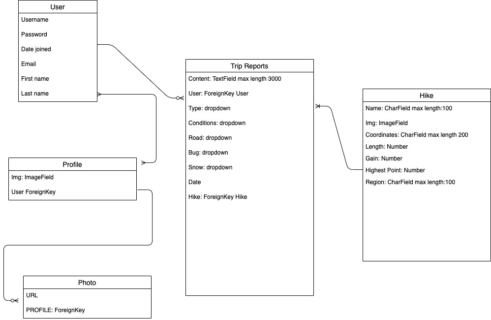

# Cloud View

POWERED BY:

- Django
- Python
- SQL
- PostgreSQL

## Login to the Test-Account for full functionality or create an account

- Username: test-account
- Password: test1234!@#$

## User Stories

### Description

Cloud View is a website that holds all of Washingtons best view hikes. Each hike has its own page with a basic description, image, and a place for our users to add their trip reports. This site will keep local hikers up to date on trail conditions, and most importantly, the VIEWS.

Users will be able to find out the following information about every View Hike:

- Trail conditions
- Snow conditions
- Road conditions
- Full description of trip report
- Bug report
- Elevation gain
- Highest point
- Date hiked (from report)
- Trailhead location
- Directions to Trailhead

### Home Page

When the user visits the Home Page of the app, they are greeted with a page that has a brief description of the app and links to "Trip Reports" and "Find a Hike"

### Hike Finder Map Page

This page has a large map API that plots the locations of all the hikes in the database. When a point is clicked, a pop up with a link to that hike and the name is displayed.

### All Trip Reports Page

This page will display all of the user-submitted trip reports listed with the newest report on top.

### Login and Register Pages

These pages will be accessible from the header at any time

### Trip Report Show Page

This is where a user can see an individual trip report from any user. This will display all the information gathered from the hiker from that particular hike.

### Hike Show Page

This page will show all the information a hiker will need for the particular hike. This page will host location information, elevation, length, hike info, and directions to the trail head. There will also be a list of all the trip reports that are from this hike.

### Edit Trip Report Page

This is where a user can edit their trip report.

### Edit Hike - Admin Only

This page will only be avalible to the admin of the site. This is a user friendly page to add in a new hike or edit an existing hike.

## Database ERD

